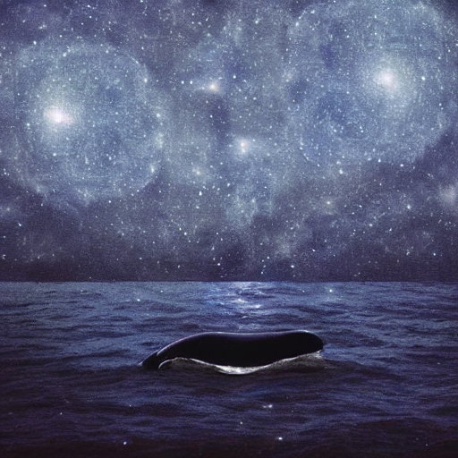
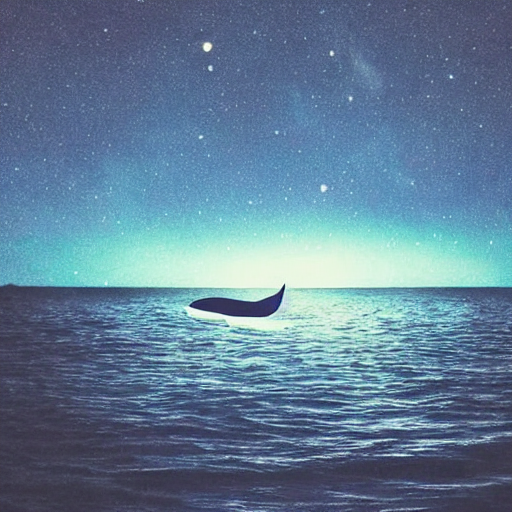
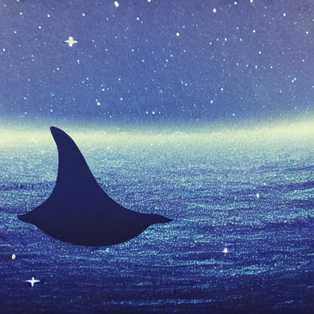

import Layout from "../../components/layout/layout"
import { Link } from "gatsby"
import { StaticImage } from "gatsby-plugin-image"

<Layout>
___
パンくず/リスト/
___
# Stable diffusion 海とクジラ テーマ出力画像
___

___

___

___

___
<Link to="/">サイトトップへ戻る</Link>
___

</Layout>
